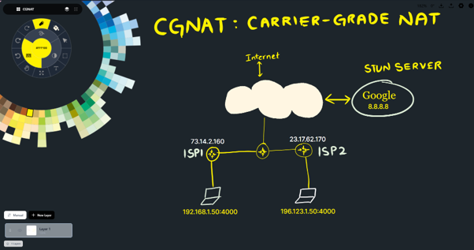

# Folish

<div align="center">


A high perf infinite canvas drawing application.

[Download](https://github.com/ppmpreetham/folish/releases) · [Roadmap](https://www.google.com/search?q=%23-roadmap) · [Discord](https://www.google.com/search?q=https://discord.gg/rickroll)

</div>

---

### What is Folish?



Folish is a digital sketchbook inspired by _Concepts_. It gives you a buttery smooth drawing experience.

## Installation

- **Windows:** Available in [Releases](https://github.com/ppmpreetham/releases/latest) page. There are two versions:
  - Installer version. Recommended, since it automatically associates .infpnt files with InfiniPaint
  - Portable version, which is a zip file containing the executable and data files, and stores configuration files next to the executable. Not recommended unless you are specifically looking for a portable version
- **macOS:** Available in [Releases](https://github.com/ppmpreetham/folish/releases/latest) page. Only for Apple Silicon
- **Linux:** There are flatpak bundles available for download on the [Releases](https://github.com/ppmpreetham/folish/releases/latest) page for both `x86_64` and `arm64`

### Custom Installation

Ensure you have [Node.js](https://www.google.com/search?q=https://nodejs.org/) (v16+) and [Rust](https://www.google.com/search?q=https://www.rust-lang.org/) installed.

```bash
git clone https://github.com/ppmpreetham/folish.git
cd folish
pnpm i
pnpm tauri dev
```

> [!TIP]
> Building for Production: To create a standalone executable for your OS, run `pnpm tauri build`

---

### Features

Folish is packed with professional grade tools designed for speed and precision.

### The Engine

- **Infinite Canvas:** No boundaries. Pan and zoom forever.
- **High Performance:** Optimized SVG rendering with canvas overlays for live strokes using `requestAnimationFrame`.
- **Velocity Smoothing:** Adaptive algorithms that stabilize your lines based on drawing speed.
- **Stylus Support:** Full pressure sensitivity for Wacom, Huion, and tablet devices.
- **Selection & Transform**: Manipulate existing strokes.

### Layer Management

Organize your artwork with a robust layer system.

| Feature               | Description                                                   |
| --------------------- | ------------------------------------------------------------- |
| **Unlimited Layers**  | Create as many layers as your RAM allows.                     |
| **Visibility & Lock** | Toggle visibility or lock layers to prevent accidental edits. |
| **Opacity Control**   | Real time transparency adjustment per layer.                  |
| **Thumbnails**        | Live visual previews of layer contents.                       |
| **Drag & Sort**       | Auto or manual sorting to arrange your stack.                 |

### Color & Style

- **COPIC Wheel:** Integrated color wheel with 69 curated sections.
- **Custom Hex:** Full support for custom color inputs.
- **Dynamic Grid:** Visual reference grid that scales intelligently with your zoom level.

---

### Tech Stack

Folish leverages the best modern web and systems programming technologies.

- **Core:** [Tauri](https://tauri.app) (Rust)
- **Frontend:** [React](https://react.dev) + [TypeScript](https://www.typescriptlang.org/)
- **State:** [Zustand](https://github.com/pmndrs/zustand) (Persistence) + [Immer](https://github.com/immerjs/immer) (Patches)
- **Rendering:** [perfect-freehand](https://github.com/steveruizok/perfect-freehand)
- **Styling:** [Tailwind CSS](https://tailwindcss.com) + [Phosphor Icons](https://phosphoricons.com)

---

### Roadmap

I am actively working on the following features:

- [ ] **Export Options:** SVG, PNG, and PDF export support.
- [ ] **Shape Tools:** Geometric primitives (Rectangle, Circle, Line).
- [ ] **Cloud Sync:** Collaborate and sync across devices.
- [ ] **Plugin System:** Community driven extensions.
- [ ] **Rulers:** Measurement and guide tools.

---

### Contributing

Contributions are welcome! Please feel free to submit a Pull Request.

1. Fork the Project
2. Create your Feature Branch (`git checkout -b feature/AmazingFeature`)
3. Commit your Changes (`git commit -m 'Add some AmazingFeature'`)
4. Push to the Branch (`git push origin feature/AmazingFeature`)
5. Open a Pull Request

### Recommended IDE Setup

- [VS Code](https://code.visualstudio.com/)
- [Tauri Extension](https://marketplace.visualstudio.com/items?itemName=tauri-apps.tauri-vscode)
- [rust-analyzer](https://marketplace.visualstudio.com/items?itemName=rust-lang.rust-analyzer)

---

### License

Distributed under the MIT License. See `LICENSE` for more information.

### Acknowledgments

- [perfect-freehand](https://github.com/steveruizok/perfect-freehand) for the stroke algorithm.
- [Concepts](https://concepts.app/) for the UI/UX inspiration.
